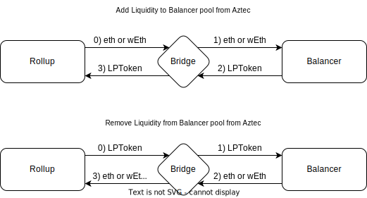

# Spec for Balancer Bridge

## What does the bridge do? Why build it?

The bridge zaps `eth` or `wEth` to get the output `LPToken` for a given pool with `_joinOrExit`.

## What protocol(s) does the bridge interact with ?

The bridge interacts with [Balancer](https://docs.balancer.fi/).

## What is the flow of the bridge?

There are one flow of Balancer operations

### Zap to Increase / Decrease Liquidity

If the bridge receives `eth` or `wEth` as the input token it will zap it on balancer for the given proportion of `LPToken` for a given pool.

It will then retrieve the `LPTokens` to the rollup network.

The gas cost for a swap is determined by the size of the swap, including the fees for the rollup.

Protocol Swap Fees are a percent of the already collected swap fees; the traders would see no change in the amount collected. The Liquidity Providers, however, would see a small change. For example, if a pool has a 1% swap fee, and there was a 10% protocol swap fee, 0.9% of each trade would be collected for the LPs, and 0.1% would be collected to the protocol fee collector contract.

For the most up-to-date protocol fee data, we must call the `getSwapFeePercentage()` on the [ProtocolFeesCollector](https://etherscan.io/address/0xce88686553686DA562CE7Cea497CE749DA109f9F#readContract) contract.

**Edge cases**:

- Liquidity might leave, making it impractical to perform swaps at a good rate
- Interaction might revert in case the minimum acceptable price is set too high or the price of the output asset moves up before the interaction settles.
- Users might get sandwiched in case the minimum acceptable price is set too low or the price of the output token goes down before the interaction settles making the users lose positive slippage.

### General Properties of convert(...) function

- The bridge is [synchronous](https://docs.aztec.network/how-aztec-works/aztec-connect/technical-intro#async-flow-explainer), and will always return `isAsync = false`.

- The Bridge perform token pre-approvals to allow the `ROLLUP_PROCESSOR` and `ZAP` to pull tokens from it.
  This is to reduce gas-overhead when performing the actions. It is safe to do, as the bridge is not holding the funds itself.

## Can tokens balances be impacted by external parties, if yes, how?

The `LPTokens` we are using are a share of a representation in the pool they belong, thus the exchange ratio is volatile, ruled by general spot market mechanics.

## Is the contract upgradeable?

No, the bridge is immutable without any admin role.

## Does the bridge maintain state?

No, the bridge don't maintain a state. However, it keeps an insignificant amount of token (dust) in the bridge to reduce gas-costs of future transactions. By having dust, we don't need to do a `sstore` from `0` to `non-zero`.
